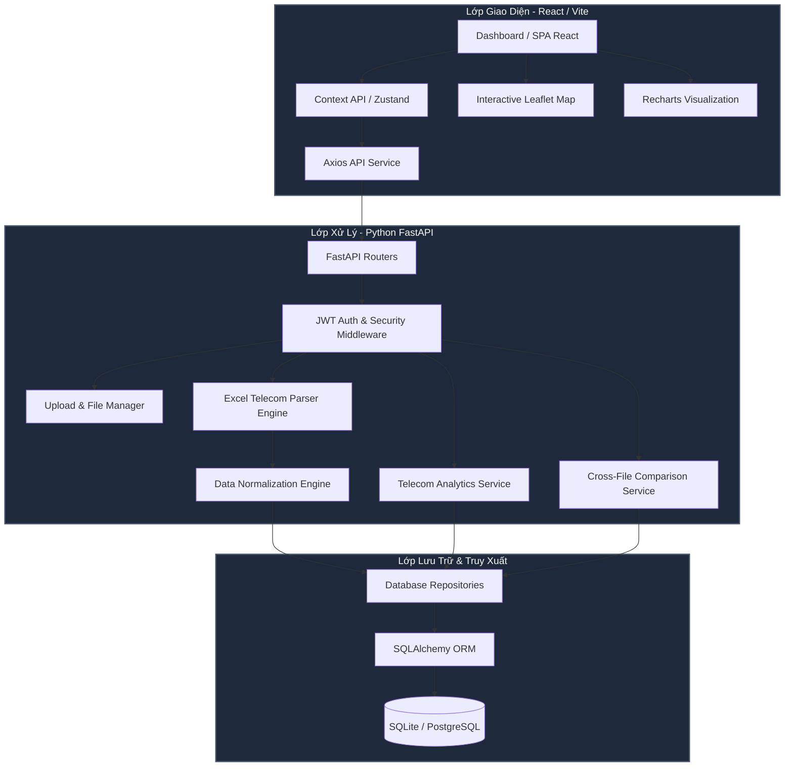

# 🏛️ Đặc Tả Kiến Trúc Hệ Thống Hiện Đại (Modern Architecture Specifications)
**Hệ thống:** Sentinel Core Analytics (Hệ Thống Phân Tích Dữ Liệu Viễn Thông Chuyên Sâu)

---

## 1. Bản Đồ Tổng Quan Kiến Trúc (Architecture Overview)

Sentinel Core được tái thiết kế toàn diện theo mô hình kiến trúc ba lớp (3-Tier Architecture) kết hợp mô hình **Service-Repository Pattern** nhằm phân tách rõ ràng giữa giao diện hiển thị, xử lý nghiệp vụ và truy xuất cơ sở dữ liệu.



---

## 2. Các Phân Lớp Kiến Trúc Chi Tiết

### 2.1 Lớp Giao Diện (Frontend Layer - React)
Dành cho trinh sát viên tương tác tác nghiệp trực quan.
*   **React 18 & Vite:** Đảm bảo tốc độ khởi động nhanh, đóng gói nhẹ và chạy mượt mà trên mọi máy tính trinh sát.
*   **TailwindCSS & Shadcn/UI:** Dựng giao diện tối giản hiện đại (style Brushed Steel) với sự kết hợp linh hoạt của các component đã được kiểm thử hiệu năng.
*   **Leaflet.js / React-Leaflet:** Vẽ bản đồ nhiệt, bản đồ di chuyển ngoại tuyến (Offline Map) đảm bảo trinh sát có thể tác chiến trong môi trường không có internet.
*   **Recharts:** Kết xuất biểu đồ tần suất gọi theo giờ, ngày trong tuần, và các biểu đồ phân tích thời lượng.

### 2.2 Lớp API & Logic Nghiệp Vụ (Backend Layer - FastAPI)
*   **FastAPI (Python):** Lựa chọn hàng đầu cho hiệu năng cao, hỗ trợ lập trình bất đồng bộ (`async/await`) giúp xử lý đồng thời nhiều tệp tải lên mà không làm nghẽn server.
*   **Pandas & OpenPyXL:** Sử dụng sức mạnh xử lý vector của Pandas để xử lý, làm sạch và tổng hợp dữ liệu từ hàng trăm nghìn dòng Excel của nhà mạng trong chưa đầy 1 giây.
*   **Security & Decryption Middleware:** Tích hợp bộ giải mã dữ liệu nhạy cảm (như Số điện thoại chủ, Họ tên) bằng thuật toán mã hóa đối xứng AES-256 để bảo vệ thông tin chuyên án ngay cả khi cơ sở dữ liệu bị rò rỉ.

### 2.3 Lớp Lưu Trữ (Database Layer)
*   **SQLAlchemy ORM:** Tạo cầu nối trừu tượng hóa cơ sở dữ liệu, cho phép hệ thống chuyển đổi dễ dàng từ **SQLite** (dành cho máy trạm offline cá nhân) sang **PostgreSQL** (dành cho máy chủ tập trung của đơn vị nghiệp vụ) chỉ bằng việc thay đổi Connection String.

---

## 3. Quy Trình Luồng Dữ Liệu (Data Pipeline)

Quy trình xử lý dữ liệu từ file thô của nhà mạng cho đến khi xuất báo cáo phân tích trinh sát được quy chuẩn hóa qua 5 bước nghiêm ngặt:

```
[File Excel CDR Nhà Mạng]
         │
         ▼
 1. IMPORT & DETECT  ──► Tải tệp bất đồng bộ (FastAPI UploadFile)
         │               Tự động nhận diện template nhà mạng (Viettel, Vina, Mobi)
         ▼
 2. PARSING          ──► Định vị Header Row (Quét từ dòng 0 - 30)
         │               Trích xuất thông tin chủ thuê bao (Họ tên, CCCD, địa chỉ...)
         ▼
 3. NORMALIZATION    ──► Chuẩn hóa số điện thoại về định dạng chuẩn (e.g. 09xxxxxxxx)
         │               Khớp múi giờ UTC+7 và định dạng DateTime thống nhất
         │               Bóc tách cặp LAC-CellID thô thành các trường số nguyên riêng biệt
         ▼
 4. PERSISTENCE      ──► Lưu thông tin thuê bao và CDR vào DB (SQLite/PostgreSQL)
         │               Mã hóa các cột thông tin nhân thân (confidential columns)
         ▼
 5. ANALYTICS        ──► Truy vấn tập hợp (Aggregation) tính toán:
                         - Xếp hạng tần suất tương tác (Top Contacts)
                         - Bản đồ quỹ đạo thời gian (Geospatial Timeline)
                         - Nhật ký đổi IMEI/IMSI (Device Churning)
```

---

## 4. Thiết Kế Module Hóa & Separation of Concerns (SoC)

Để tránh lặp lại sai lầm phình to tệp tin (monolith) như hệ thống cũ, dự án mới được phân rã thành các module độc lập tuyệt đối:

1.  **Parser Module (`app/services/parser/`):** Chịu trách nhiệm duy nhất là đọc dữ liệu thô từ file Excel và xuất ra cấu trúc JSON chưa chuẩn hóa. Không chứa logic lưu DB hay tính toán tần suất.
2.  **Normalization Module (`app/services/normalizer/`):** Chịu trách nhiệm làm sạch dữ liệu (Regex số điện thoại, định dạng ngày tháng, tách LAC/Cell).
3.  **Analytics Module (`app/services/analytics/`):** Chịu trách nhiệm thực hiện các thuật toán gom cụm giao tiếp, phân tích thời gian hoạt động, tính toán tọa độ di chuyển.
4.  **Database Module (`app/db/`):** Định nghĩa Schema bảng biểu và các Repository thực hiện truy vấn SQL tối ưu.
5.  **Export Module (`app/services/exporter/`):** Tạo file Excel báo cáo nghiệp vụ đã được định dạng màu sắc cảnh báo dòng tiền bất thường để in ấn phục vụ chuyên án.
