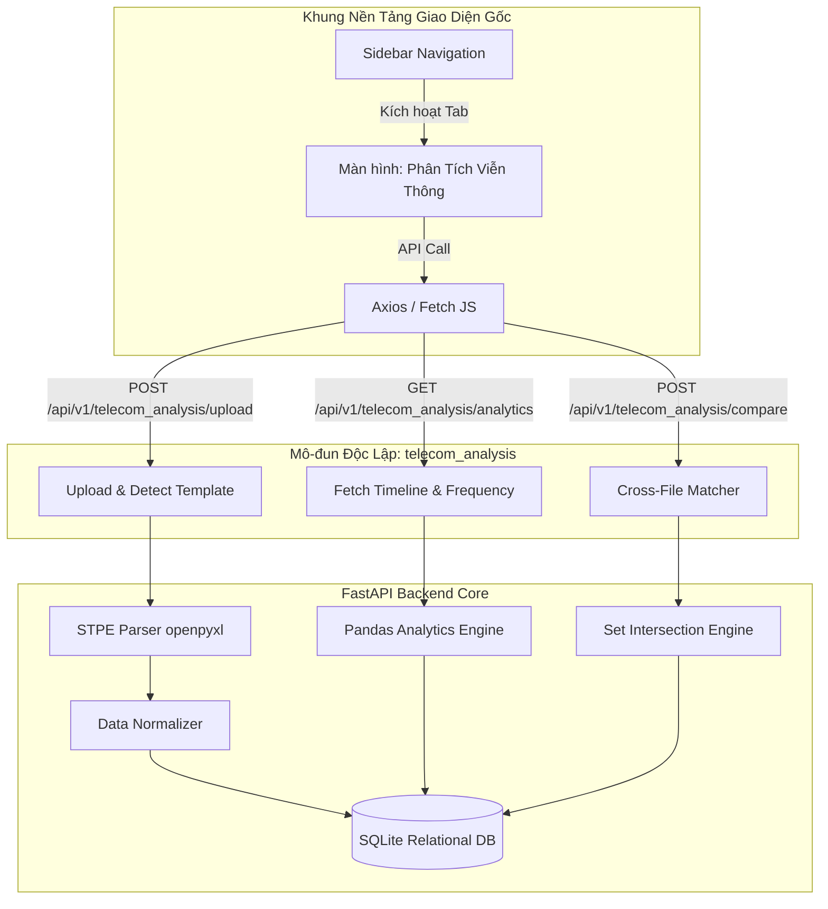

# 🔄 Kế Hoạch Tích Hợp Mô-đun Viễn Thông (Telecom Integration Plan)
**Dự án:** Sentinel Platform Integration  
**Mô-đun:** `telecom_analysis` (Tích hợp phân tích dữ liệu viễn thông chuyên sâu)

---

## 1. Phân Tích Kiến Trúc Hệ Thống Hiện Tại (Platform Analysis)

### 1.1 Khung Nền Tảng Giao Diện Hiện Tại (Root Frontend)
Hiện tại, trang web nền tảng chính (được thiết kế theo style công nghiệp Brushed Steel tối giản sang trọng) bao gồm:
*   `index.html` (ở thư mục gốc): Định hình bố cục Sidebar phẳng chuyên nghiệp, bảng hiển thị chi tiết (Dashboard, GTP, FLA, SRAU) và hệ thống tab động.
*   `styles.css` (ở thư mục gốc): Chứa toàn bộ design tokens (bảng màu HSL Slate/Cyan), hiệu ứng radar quét, nút nhấn tactical mượt mà và giao diện kính mờ (glassmorphism).
*   `app.js` (ở thư mục gốc): Điều khiển chuyển đổi tab, giả lập các tiến trình tác nghiệp như vẽ bản đồ radar di chuyển và hiển thị nhật ký kiểm toán.

### 1.2 Phân Hệ Viễn Thông Cũ (Legacy Telecom Module)
Nằm trong thư mục `Mau/`, bao gồm giao diện CDR Analyzer cổ điển xử lý hoàn toàn trên Client-side.
*   *Hạn chế lớn:* `script.js` nặng tới 627KB chứa toàn bộ logic đọc file Excel thô, quản lý dữ liệu bằng `LocalStorage` (dễ sập khi dung lượng tệp tin vượt quá 10MB) và xử lý giao diện DOM thủ công gây chậm lag.
*   *Mục tiêu tích hợp:* Tách toàn bộ logic đọc Excel, làm sạch dữ liệu, lọc tần suất và tính toán lộ trình di chuyển của hệ thống cũ lên **Backend FastAPI**. Giao diện mới sẽ tái sử dụng bộ khung Brushed Steel ở thư mục gốc để hiển thị động thông tin trả về từ API Backend.

---

## 2. Thiết Kế Kiến Trúc Tích Hợp (Integration Architecture)

Mô-đun `telecom_analysis` sẽ được tích hợp dưới dạng một module độc lập ở cả Frontend và Backend, kết nối trực tiếp với giao diện cốt lõi:

---

## 3. Đặc Tả Tích Hợp Module Giao Diện (Frontend UI Integration)

Màn hình tác nghiệp viễn thông `telecom_analysis` sẽ kế thừa bộ khung thiết kế của trang gốc và hiển thị động thông qua các API Backend:

1.  **Sidebar Menu:** Thêm liên kết trực quan `Phân Tích Viễn Thông` vào danh sách điều hướng chính của nền tảng.
2.  **Upload Center:** Tích hợp trình kéo thả Excel chuyên dụng, hiển thị thanh tiến trình quét động khi tệp tin đang được xử lý ở Backend.
3.  **Dashboard Số Liệu Viễn Thông:**
    *   **Thẻ Thông Tin Thuê Bao:** Hiển thị tự động họ tên, CCCD, địa chỉ, ngày kích hoạt sim (giải mã bảo mật AES-256 từ cơ sở dữ liệu).
    *   **Bảng Nhật Ký Cuộc Gọi (CDR Grid):** Thay thế bảng dữ liệu giả lập bằng bảng dữ liệu thực, hỗ trợ lọc nhanh theo loại cuộc gọi (Thoại/SMS) và thời gian hoạt động.
4.  **Bản đồ Vị Trí Vệ Tinh (GTP Offline Map):** Liên kết timeline trượt của trinh sát để kết xuất lộ trình di chuyển thực tế từ cơ sở dữ liệu trạm phát sóng BTS.
5.  **Biểu đồ Tần Suất & Tương Tác:** Vẽ biểu đồ cột Recharts động phân bổ lưu lượng theo giờ dựa trên API Backend.

---

## 4. Đặc Tả APIs Backend (`telecom_analysis` Module)

Hệ thống API Backend sử dụng chuẩn RESTful, trả về dữ liệu định dạng JSON mã hóa an toàn:

### 4.1 Nạp và Phân Tích File (Parser API)
*   **Endpoint:** `POST /api/v1/telecom_analysis/upload`
*   **Body:** `multipart/form-data` (Tệp tin Excel CDR)
*   **Xử lý:**
    1.  Bắt đầu tiến trình bất đồng bộ nhận file.
    2.  Nhận diện nhà mạng dựa trên cấu trúc tiêu đề (Viettel, Vina, Mobi).
    3.  Bóc tách metadata chủ thuê bao và các dòng bản ghi.
    4.  Chuẩn hóa số điện thoại, tách LAC/Cell.
    5.  Mã hóa các thông tin nhạy cảm và lưu trữ vào SQLite DB.
*   **Response:** Trạng thái nạp tệp và ID của thuê bao phục vụ truy vấn hiển thị.

### 4.2 Thống Kê Tần Suất & Hành Vi (Behavior Analytics API)
*   **Endpoint:** `GET /api/v1/telecom_analysis/analytics/{subscriber_id}`
*   **Xử lý:**
    1.  Truy vấn danh sách CDR của thuê bao chỉ định.
    2.  Tính toán Top 10 số điện thoại liên lạc nhiều nhất kèm theo phân bổ thời lượng cuộc gọi.
    3.  Tính toán phân bổ 24h hoạt động và biểu đồ ngày hoạt động trong tuần.
*   **Response:** Dữ liệu JSON chứa các mảng thống kê đã sẵn sàng vẽ biểu đồ.

### 4.3 Quỹ Đạo Không Gian (Geospatial Timeline API)
*   **Endpoint:** `GET /api/v1/telecom_analysis/timeline/{subscriber_id}`
*   **Xử lý:**
    1.  Truy vấn chuỗi các điểm chốt sóng LAC/Cell theo trật tự thời gian.
    2.  Liên kết thông tin trạm BTS từ bảng `towers` để lấy tọa độ Lat, Lon.
*   **Response:** Mảng chuỗi lịch trình di chuyển chi tiết của mục tiêu.

### 4.4 Đối Soát Chéo Tập Hợp (Cross-Analysis API)
*   **Endpoint:** `POST /api/v1/telecom_analysis/compare`
*   **Body:** `{"subscriber_ids": [1, 2, 3], "compare_type": "contacts"}` (contacts/locations/imeis)
*   **Response:** Danh sách các phần tử trùng khớp chung giữa các đối tượng điều tra.

---

## 5. Lộ Trình Triển Khai Tích Hợp (Integration Roadmap)

1.  **Bước 1: Khởi tạo Cấu Trúc Thư Mục Module Cô Lập:**
    *   Tạo thư mục `backend/app/api/endpoints/telecom_analysis.py` và `backend/app/services/telecom_analysis/`.
2.  **Bước 2: Phát Triển Trình Đọc Excel Đa Mẫu (FastAPI Engine):**
    *   Lập trình và hoàn thiện bộ đọc Excel Viettel, Vinaphone, Mobifone ở Backend sử dụng Pandas, lưu trữ dữ liệu vào các bảng quan hệ SQLite.
3.  **Bước 3: Phát Triển Hệ Thống REST API:**
    *   Xây dựng và kiểm thử hoàn chỉnh các endpoint Upload, Analytics, Timeline và Compare.
4.  **Bước 4: Kết Nối Frontend & Xử Lý Đồng Bộ:**
    *   Tích hợp các lời gọi API thực tế vào tệp tin `app.js` gốc để thay thế toàn bộ dữ liệu mock bằng dữ liệu viễn thông thực tế từ Backend.
    *   Tối ưu hóa giao diện hiển thị mượt mà trên nền tảng Brushed Steel sẵn có.
