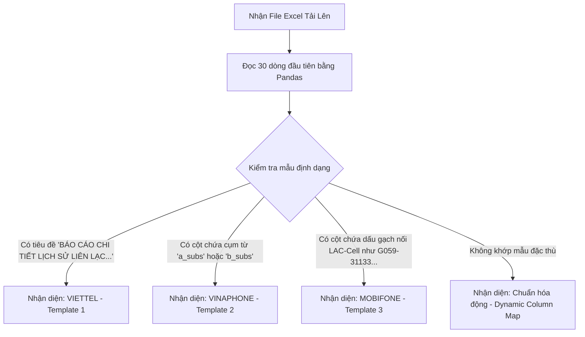

# 🚀 Chiến Lược Phân Tích Cú Pháp Excel Viễn Thông (Telecom Excel Parser Strategy)
**Hệ thống:** Sentinel Telecom Parser Engine (STPE)

---

## 1. Cơ Chế Nhận Diện Tự Động Nhà Mạng (Dynamic Template Detection)

Khi trinh sát tải lên một hoặc nhiều tệp Excel dữ liệu CDR, hệ thống không bắt buộc trinh sát phải chọn nhà mạng thủ công. Thay vào đó, bộ lọc **STPE** ở Backend sẽ tự động phát hiện mẫu template (Template Detection Engine) dựa trên cấu trúc các dòng đầu tiên và dấu hiệu đặc trưng của cột:

### 1.1 Chi tiết dấu hiệu nhận diện đặc trưng (Heuristic Signatures)
1.  **Viettel (Template 1):**
    *   *Dấu hiệu:* Dòng đầu tiên luôn chứa chuỗi: `"BÁO CÁO CHI TIẾT LỊCH SỬ LIÊN LẠC THOẠI & SMS"`.
    *   *Metadata:* Các ô thông tin nhân thân nằm ở các dòng 0 - 20 với tiêu đề tĩnh như `"Họ Tên"`, `"Số thuê bao"`, `"Số giấy tờ"`.
    *   *Header:* Bắt đầu ở dòng 21 hoặc dòng 8 chứa các cột chính xác: `['#', 'Số đi', 'Số đến', 'Thời gian', 'Giây', 'IMEI', 'Mã tỉnh', 'TYPE', 'Direction', 'Địa chỉ trạm BTS', 'LAC', 'Số Cell']`.
2.  **Vinaphone (Template 2):**
    *   *Dấu hiệu:* Cột chứa số điện thoại thường được đặt tên là `a_subs` (thuê bao chủ) và `b_subs` (thuê bao đối tác).
    *   *Header:* Có vị trí dòng tiêu đề linh hoạt hơn, được định dạng theo cấu trúc đối soát thanh toán nội bộ của VNPT.
3.  **Mobifone (Template 3):**
    *   *Dấu hiệu:* Có cấu trúc gộp cột địa lý, cụ thể cột trạm phát thường chứa mã ghép định dạng `LAC-Cell` (ví dụ: `31133-43691`).
    *   *Header:* Nằm ở các dòng phía trên và các cột được phân tách đơn giản.

---

## 2. Chuẩn Hóa Số Điện Thoại (Phone Number Normalization Rules)

Số điện thoại đầu vào từ các nhà mạng rất đa dạng do định dạng lưu trữ (e.g. `84986556206`, `986556206`, `+84 986 556 206`). Hệ thống áp dụng quy tắc chuẩn hóa nghiêm ngặt về định dạng số di động Việt Nam:

1.  **Loại bỏ ký tự thừa:** Sử dụng Regex loại bỏ tất cả khoảng trắng, dấu gạch nối `-`, dấu ngoặc đơn `()`, và dấu `+`.
    *   *Regex:* `re.sub(r'[\s\-\(\)\+]', '', phone_raw)`
2.  **Chuẩn hóa đầu số Quốc gia:**
    *   Nếu số bắt đầu bằng `84` (mã quốc gia Việt Nam) và có độ dài từ 11-12 ký tự: Thay thế đầu `84` thành số `0` ở trước.
        *   Ví dụ: `84986556206` ──► `0986556206`.
    *   Nếu số bắt đầu bằng mã vùng di động trực tiếp (như `98`, `96`, `38`...) và có độ dài 9 ký tự: Thêm số `0` vào đầu để tạo số 10 chữ số chuẩn.
        *   Ví dụ: `986556206` ──► `0986556206`.
3.  **Xử lý các số dịch vụ/Vas:**
    *   Các số dịch vụ đặc biệt (như `198`, `1800xxx`, `VNeID`, `Brandname` của ngân hàng) được giữ nguyên định dạng chuỗi gốc để nhận dạng các tin nhắn tự động.

---

## 3. Đồng Nhất Mốc Thời Gian (Datetime Unified Parser)

Thời gian cuộc gọi trong các file Excel có thể hiển thị dưới dạng chuỗi (String) hoặc số thực Excel (Excel Serial Float Numbers). Trình phân tích áp dụng quy trình xử lý kép:

1.  **Trường hợp Dữ liệu dạng Số thực Excel:**
    *   Sử dụng thư viện `pandas` hoặc `xlrd` tích hợp sẵn phương thức đổi định dạng số thực của Excel sang Python Datetime:
        *   `pd.to_datetime(excel_float, unit='D', origin='1899-12-30')`
2.  **Trường hợp Dữ liệu dạng Chuỗi:**
    *   Áp dụng các định dạng quét thứ tự ưu tiên (DateTime Formats Stack):
        1.  `%d/%m/%Y %H:%M:%S` (Chuẩn Việt Nam thường gặp nhất: `01/06/2025 05:57:45`)
        2.  `%Y-%m-%d %H:%M:%S` (Chuẩn ISO quốc tế)
        3.  `%d-%m-%Y %H:%M:%S`
    *   Tự động phát hiện và xử lý lỗi ngày tháng bị đảo lộn ngày/tháng (ví dụ: ngày 06 tháng 12 bị parse thành ngày 12 tháng 06) thông qua việc đối soát quy luật chuỗi thời gian liên tiếp trong toàn bộ file.

---

## 4. Tách Cấu Trúc LAC/Cell Chuyên Sâu (Geospatial Extractions)

Thông số địa lý trạm BTS là chìa khóa để trinh sát định vị đối tượng.
*   **Trường hợp cột LAC và Cell tách riêng (Viettel):**
    *   Hệ thống chuyển đổi trực tiếp giá trị chuỗi thành số nguyên (Integer).
    *   Loại bỏ các ký tự rác hoặc giá trị không xác định (như `null`, `nan`, `unknown`).
*   **Trường hợp cột LAC và Cell gộp chung (Mobifone/Cấu trúc tùy biến):**
    *   Hệ thống sử dụng Regex tìm kiếm mẫu số phân tách bằng các ký tự đặc biệt (`-`, `/`, `_`, `\`).
    *   *Regex trích xuất:* `^(\d+)[\-\/\\_](\d+)$`
    *   Nếu khớp mẫu, hệ thống tự động bóc tách thành 2 trường riêng biệt: `lac_id` (nhóm 1) và `cell_id` (nhóm 2) để thực hiện lưu trữ chuẩn hóa vào cơ sở dữ liệu.
